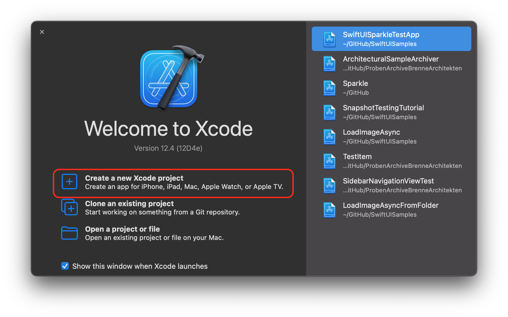
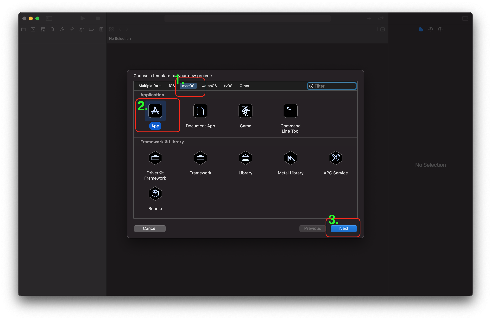
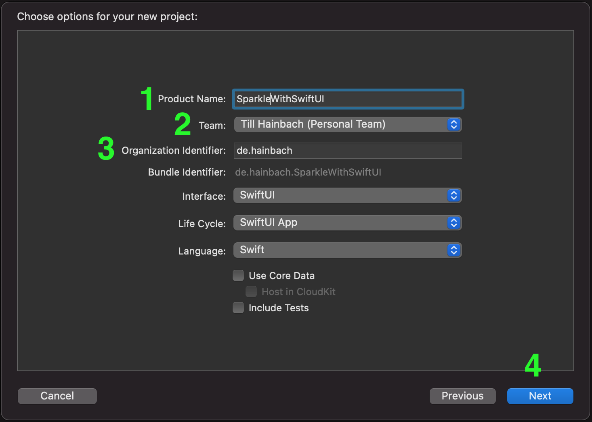

# SwiftUISparkleTestApp
Sample Project for using Sparkle and SwiftUI

Since I could not find a could step-by-step guide for setting up Sparkle within a SwiftUI-based macOS-App
I thought I'll publish some of my today's findings here in a sample repo.

My goal was to use SwiftUI for a macOS, with Sparkle as an AutoUpdater and use
github pages and github releases for the updating process.

## Setting up the Xcode project.

Open Xcode and select a "Create new Xcode-Project".



Select "macOS -> App -> Next".



Enter your product name, team and bundle identifier and click next



Choose a location where you want to store your project. Select "Create git repo..." and click "next".

Go to the project settings:
   
   - "Signing & Capabilities" -> App Sandbox allow:
        - Incoming Connections
        - Outgoing Connections
        
 ## Get Sparkle 2.x
 
For a sandboxed app you need Sparkle 2.x (currently in beta). Unfortunately, there are no prebuilt binaries available
so you have to build them yourself.

From Sparkle's [readme](https://github.com/sparkle-project/Sparkle/tree/2.x) and [docs](https://sparkle-project.org/documentation/):

```sh
git clone https://github.com/sparkle-project/Sparkle

cd Sparkle

git checkout 2.x
git submodule update --init --recursive

make release
```

